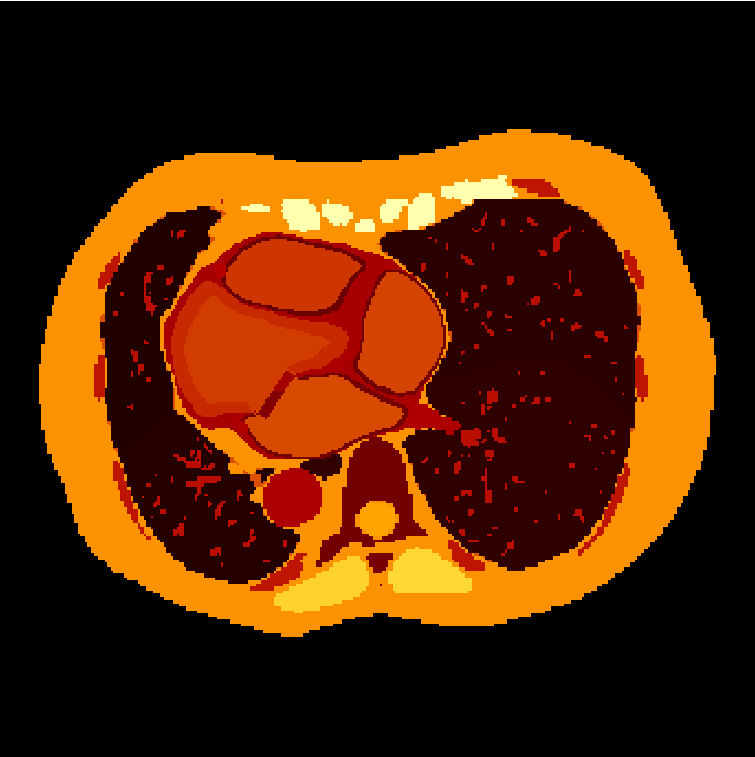
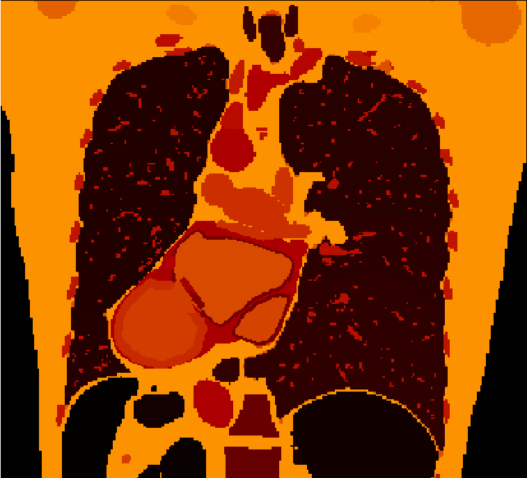
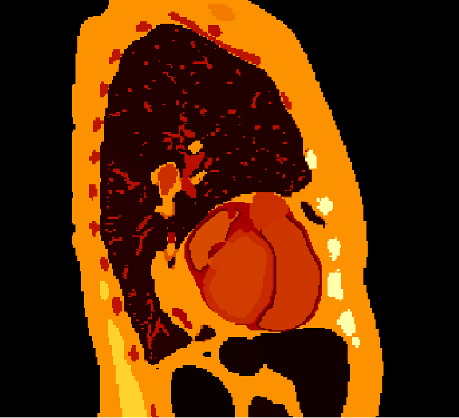
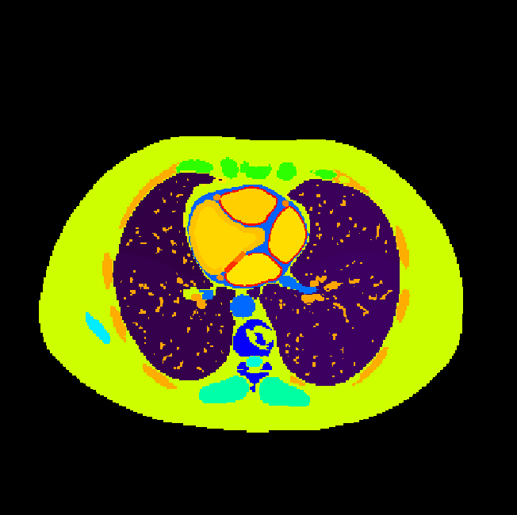
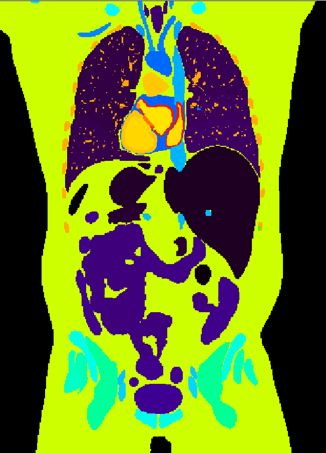
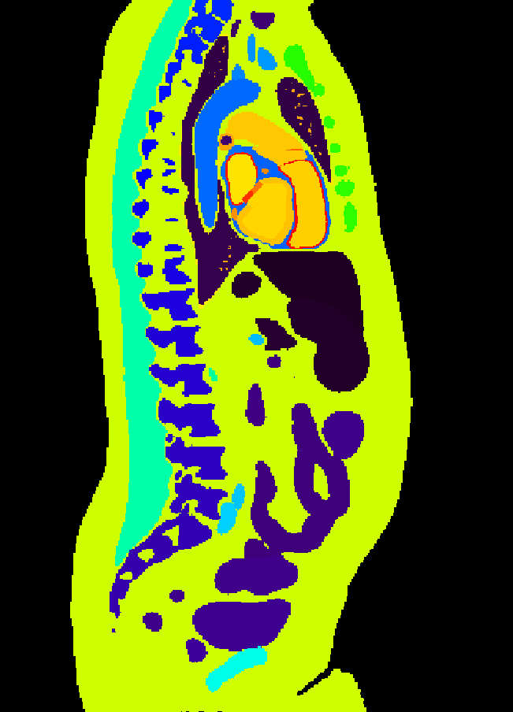

# TartagliaS
This Multiple Segmentation Ensemble Algorithm has been developed as part of the Tartaglia IA project to improve medical research. The algorithm runs currently in two versions. The first one will run and assemble the segmantation results of TotalSegmentator, Platipy and Moose(v3) for every organ in the body using a mode for each voxel in the image, plus some specifically chosen structures which only show up in one model. The second one uses TotalSegmentator as its core, adding most structures from platipy, some of them processed to make them more realistic or to include other structures derived from them, plus a few chosen structures from Moose(v3) models, although not all of them as the first version does.

The first step to take in order to build this multiple segmentation ensemble is (amazingly, I know) to install the Medical Image Segmentators we have chosen. In this first iteration, we have worked with only three segmentators, although two of them have several different models, this segmentators are TotalSegmentator, Platipy and Moose(v3).

TotalSegmentator GitHub page: https://github.com/wasserth/TotalSegmentator

Platipy GiHhub page: https://github.com/pyplati/platipy

Moose GitHub page: https://github.com/ENHANCE-PET/MOOSE

## Requirements:

To ensure a good experience, there are a few things you need to have in mind (and in your computer):

- **Operating System**: This software was developed in Ubuntu 24.04, and has not been tested in other OS. Installation is the only part which should be affected for other Liunx based OS, and I do not know yet if it will work at all in Windows (although it should in a Linux emulator).

- **Memory**: This software packs some heavy gear! At least 16GB of RAM should be needed for a smoother run.

- **GPU**: Some parts of the sofware allow for GPU acceleration to run faster, so it could be a good idea to have a good GPU. It is not a dead deal if you do not have one, though.

- **Python**: Python 3.10 must be used, at least for your virtual environment. The installation instructions already cover this, but better safe than sorry!

## Installation guide:

To install and use the segmentators, follow the next instructions (Ubuntu 24.04 OS, a couple lines might have to be edited in requirements.txt for other OS):

**1) Create a virtual environment:**

   - mkdir [a_name -> direcotry/environment name]
   - cd [a_name]
   - conda create --name [a_name] python=3.10
  
**2) Install the segmentators and other necessary packets:**

   - conda activate [a_name]
   - Download 'requirements.txt' into [a_name].
   - pip install -r requirements.txt
   - Look for some CTs to download and segment, a few places to find CTs are:
      - https://zenodo.org/records/10047292 (Full TotalSegmentator training dataset, there are several repeated images here under different name)
      - https://zenodo.org/records/10047263 (Reduced TotalSegmentator training dataset)
      - https://www.cancerimagingarchive.net/collection/ct-images-in-covid-19/
      - https://www.kaggle.com/datasets/mohamedhanyyy/chest-ctscan-images

## How to use it:

**STEP 1) *To run them all...***

   - Download 'runsegms.sh' and the folder 'runsegms' into [a_name].
   - Be sure that there is no current file or directory in [a_name] which ends in *.nii.gz.
   - Copy your original CT files to [a_name] in *.nii.gz format, and change their names so they begin with 'CT_'.
   - Run 'sh runsegms.sh' (Linux OS).
   - Enjoy some time doing something else while the segmentators run.

This will create several folders and run all the segmentators in order, placing their output files in the right folder. BE WARNED, ADVENTURER!!  IF YOU CHANGE THE NAME OR REMOVE ANY OF THIS DIRECTORIES, THE NEXT STEPS ARE DOOMED TO FAIL UNLESS YOU CHANGE ALSO THE CODE!! The directory 'used' is of special importance here, beware of put or remove files there.

**STEP 2) *...and in Darkness bind them:***

   - Pre-installed software might interfere with this application, you might need to take the next steps in order for the next sections to run properly:
     - pip uninstall stl
     - pip install numpy-stl
     - pip install fastmorph
   - Download 'runproc.sh' and 'runprocPTyTS.sh' into [a_name]. This two files are, in fact, the same but with different commented lines so, if you are up to edit them yourself, you can use only one of them and edit it as you need.
   - Download the folder 'runproc' into [a_name].
   - run 'sh runproc.sh' or 'sh runproc_PTyTS.sh' (Linux OS, explanation of what each of them do below). There are several input options to choose here:
      - `--flungs` .- Will assemble the lung lobes into a single structure representing the lungs.
      - `--fheart` .- Will assemble all the heart structures into a single structure representingt the full heart withuot any cardiac structures (This option is incompatible with the next ones, so take care or weird things might happen).
      - `--harteries` .- Will include the coronary arteries into the assembled image. If this option is not set, those structures will not be included.
      - `--hvalves` .- Will include the different heart valves (mitral, tricuspid, aortic and pulmonary) into the assembled image (Important choice for another part of this project which will simulate the heartbeat).
   - Enjoy some time doing anything else while the software is assembling the segmented images.

To run runproc.sh will run the most basic version of the sofware, but it will include all structures from each segmentator model and assemble them, although the ensembled image will not be as detailed for the cardiac structures. The runprocPTyTS.sh version will not include all the models from each segmentator, losing detail in certain sections of the body, but will be more detailed in regards of the cardiac structures the assembled image will show.

This will create a directory called 'mix', where the ensembled images will be put, ready to be used in the postprocessing. There should be a mix_0 image, with all the basic structures and thinned valves in regards of its original shape, and a mix_1 image, in which some postprocessing has been done, like splitting the valves and cleaning the Miocardium around them. NOTE:-- And, right now, several images with the valves rotated by a certain degree will also show up into your [a_name] folder.

The ensembled image will be created partly using the 'mode' between the different segmented model images for each voxel, plus some specifically picked up choices to assure the presence of certain structures, like the valves (if you choose that option), which show up only in one segmentator model.

A few assembled images:

  
  

This sofware has been specially developed to improve the quality of the cardiac structures in medical imaging, and its sourronding areas (like the lungs). As such, the selected images show this regions with special detail, while not being as detailded as the model allows in other parts of the body.

**STEP 3) Assigning properties to each label.**

   - Download 'runnpz.sh' and the runnpz folder into [a_name]
   - run 'sh runnpz.sh' (Linux OS). You have the option to run it from the original assembled file, using `--noXCAT`. If you do not use this option, the software will automatically generate a file in mix with the XCAT phantom model labels, and then create an .npz file from that XCAT file.

This will generate a npz file in your main directory, assigning several tissue properties to each label, like density or sound speed, and creating the timed frames which will allow the Ultrasound simulator to run properly later on.

You can find a class map for each label in the class_map_mix.py file settled into the runnpz folder.

## To do list:

   - If cardiac and lung structures will be kept as the most detailed strucutres, while keeping the detail of other structures low than the software allows, it might be a good idea, in order to reduce computing time, to run the assembling only for the regions with lung and cardiac structures, while letting other sections to be defined by only one segmentator output.
   - If a detailed image is prefered over the 'only cardica and lung structures' point of view, merge mix_img.py and mix_img_TSyPT.py, plus preproc.py and preproc_TSyPT.py files, so the software can assenble images as detailed as possible in every section (clue: remove cardiac structures from some segmentation models and include only the platipy ones in the TSyPT files). This will also remove the current need for the usage of two runproc files.
   - Check the crop distances of the images in the npz generator file, it might give troubles with small images, although is necessary so big images do not give memory issues (another possibility is to improve the code even more so it can handle bigger chuncks of data).
   - Some of the rotated valves are showing up a strange and unrealistic behavior after we transformed the images from 1.5 mm spacing to 1.0 mm spacing (before that point, all rotated valves showed up as they were intended to do).
   

## Contributors:

<!-- ALL-CONTRIBUTORS-LIST:START - Do not remove or modify this section -->
<!-- prettier-ignore-start -->
<!-- markdownlint-disable -->
<table>
  <tbody>
    <tr>
      <td align="center" valign="top" width="14.28%"><a href="https://github.com/pabma"> <b>Pablo Martínez Martínez Gabás</b></a> <a href="https://github.com/pabma/TartagliaS/commits?author=pabma" title="Code">💻</a> <a href="https://github.com/pabma/TartagliaS/commits?author=pabma" title="Documentation">📖</a></td>
    </tr>
  </tbody>
</table>

<!-- markdownlint-restore -->
<!-- prettier-ignore-end -->

<!-- ALL-CONTRIBUTORS-LIST:END -->
